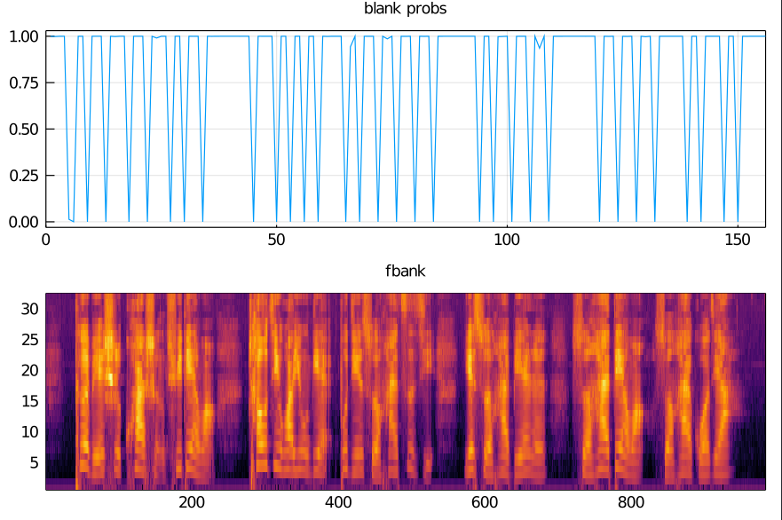

# ASR 端到端声学模型训练案例

## 介绍
这是一个**端到端**语音识别声学模型训练的简单案例，其中 `data` 文件夹中的少量示例数据来源于清华开源的30小时语音数据集。`./doc/records.txt` 文件中记录了这些示例数据的文件名及其标注。

```
./data/A2_103.wav 1196 124 156 1190 501 1096 501 1096 982 327 374 935 1136 968 614 283 8 645 918 418 181 1008 1097 614 283 842 982 1162 830 619 968 181 1008 1097
./data/A2_108.wav 788 1047 26 370 301 398 370 301 992 418 740 697 353 1083 1048 1047 26 1008 841 1207 1088 841 1083 841 389 903 152 562 1086 385 455
./data/A2_116.wav 397 1090 146 415 1048 422 435 202 328 996 750 1176 492 1095 202 801 1099 189 407 852 1001 1048 1160 987 1099 801 844 1066 782 911 146 279 1157
...
```
## 运行
将 `ASR_TH30_Demo` 目录设置为工作目录，然后在 `REPL` 交互环境下直接运行

```julia
julia> include("./ASRTrain.jl")
```

便会进入到声学模型的训练中去。训练结束后，可以运行 `PlotAsrThings.jl` 脚本

```julia
julia> include("./PlotAsrThings.jl")
```
观察声学模型的权重分布，以及声学特征、blank 输出概率。当数据量较大时，训练几个 epoch 后，一般就会出现尖峰预测现象了。比如：


